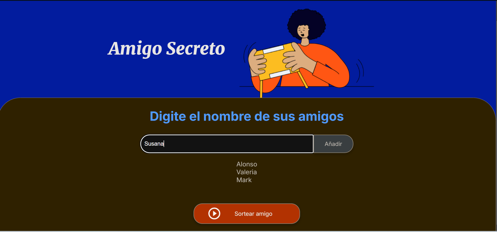
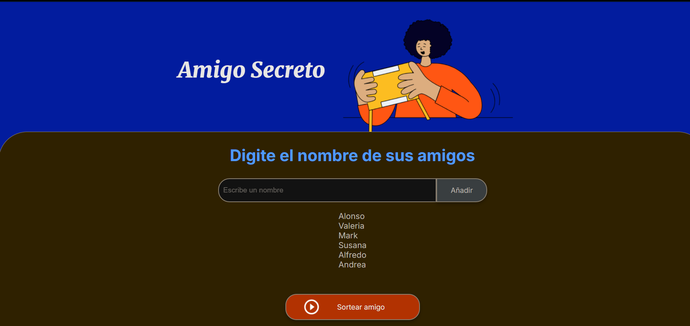
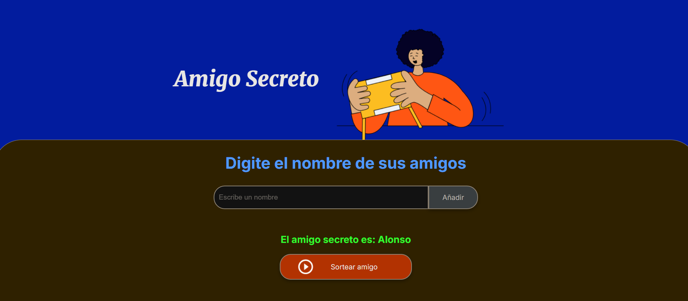

# Challenge Amigo Secreto 🎁

Este proyecto es una aplicación web sencilla para realizar un **sorteo de amigo secreto** de manera aleatoria.

## 📌 Funcionalidades
- Agregar nombres a una lista de participantes.
- Mostrar la lista de amigos ingresados.
- Realizar el sorteo y mostrar al "amigo secreto" seleccionado.

## 🚀 Tecnologías utilizadas
- **HTML**: Estructura del sitio web.
- **CSS**: Estilos y diseño.
- **JavaScript**: Lógica del sorteo y manipulación del DOM.

## 🎯 Cómo usarlo
1. Ingresa los nombres de los participantes en el campo de texto.
2. Presiona el botón "Agregar" para añadirlos a la lista.
3. Cuando todos los nombres estén en la lista, presiona "Sortear".
4. El sistema elegirá aleatoriamente un amigo secreto y lo mostrará en pantalla.

## 📸 Capturas de pantalla 

### 1️⃣ Agregando nombres  
  

### 2️⃣ Lista de participantes  
  

### 3️⃣ Sorteo realizado  
  


## 🛠️ Cómo ejecutar el proyecto
1. Descarga los archivos o clona el repositorio:
   ```bash
   git clone https://github.com/Sussyvily/challenge-amigo-secreto.git
